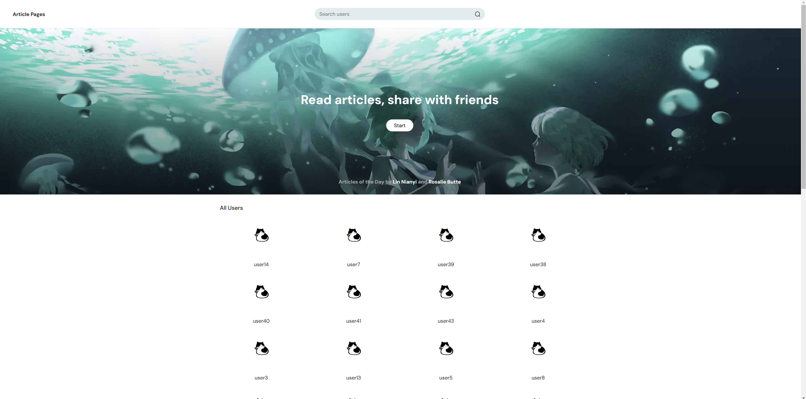
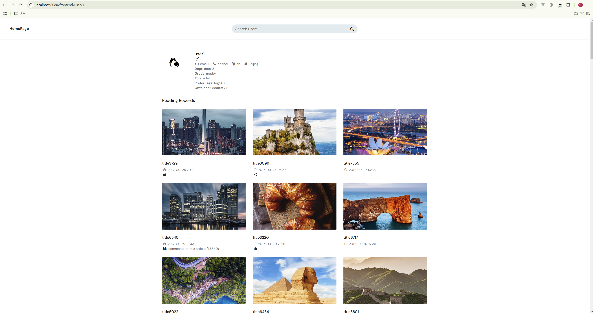
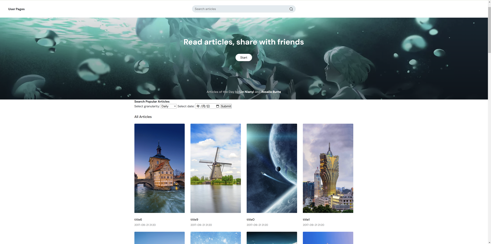
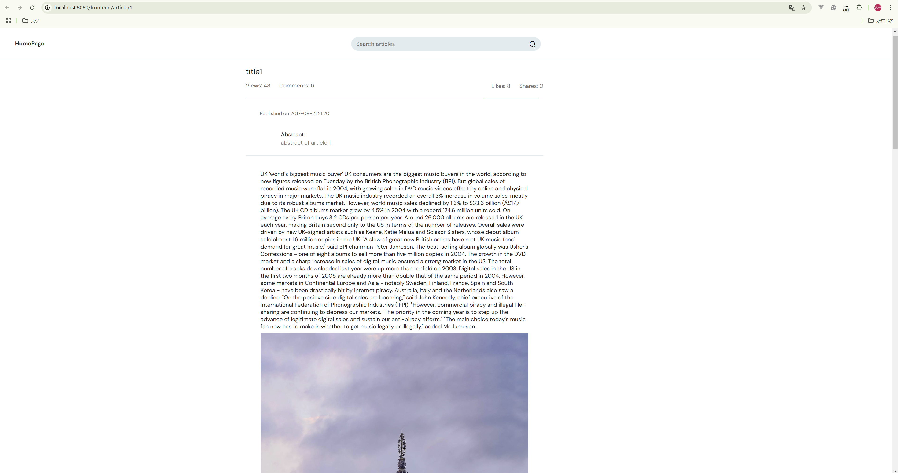
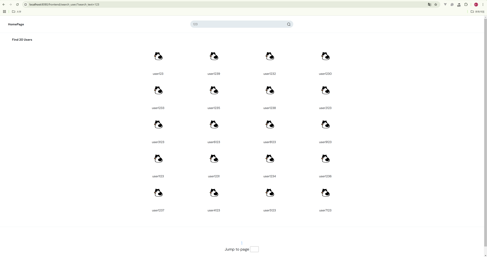
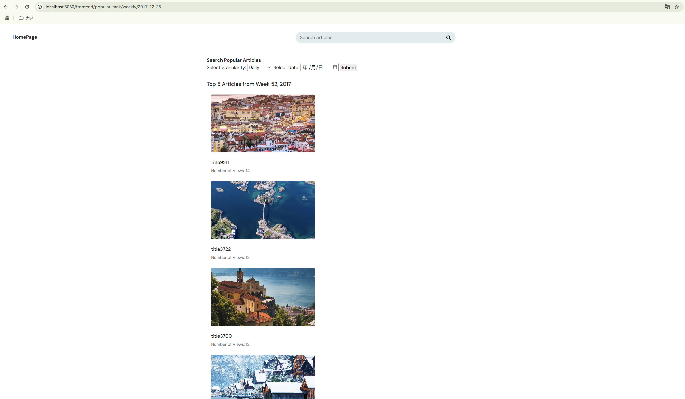

# Manual


## 1 Initial Setup

First, clone the repository from [Github](https://github.com/linny2002/DDBS).  

Then, extract the data generation files into the db-generation directory and run `python3 genTable_mongoDB10G.py` (The videos should be in mp4 format to be playable in the webbrowser). The resulting file tree should look similar like this:  

```
./
├── backend
│   ├── static
│   ├── templates
│   └── backend.py
├── configs
│   ├── nginx.conf
│   ├── storage_nginx.conf
├── db-generation
│   ├── articles
│   ├── bbc_news_texts
│   ├── article.dat
│   ├── genTable_mongoDB10G.py
...
├── .gitignore
├── calcTables.py
├── docker-compose.yml
├── import_data_to_mongo.py
├── import_map_to_mongo.py
├── init.sh
├── README.md
├── slice_table.py
├── task_splitting.md
├── update_file_to_dfs.py
├── update_file_to_dfs.sh
└── utils.py
```
This project requires Docker and Docker-compose. To pull docker image, you may need to replace the resources with mirror resources.  

To initialize the database system run

```bash
bash init.sh
```

This creates and starts the databases and the FastDFS server as docker-compose services, fragments the data and imports it to the respective databases, and uploads the images, texts and videos to the FastDFS storage server.

The output is like

```bash
...
2024-12-27T14:11:26.960+0000    connected to: mongodb://localhost/
2024-12-27T14:11:26.984+0000    22 document(s) imported successfully. 0 document(s) failed to import.
Line 27: Fri Dec 27 22:11:27 CST 2024 - Command took 41 seconds
{ "acknowledged" : true, "deletedCount" : 0 }
2024-12-27T14:11:26.960+0000    connected to: mongodb://localhost/
2024-12-27T14:11:26.984+0000    22 document(s) imported successfully. 0 document(s) failed to import.
Line 27: Fri Dec 27 22:11:27 CST 2024 - Command took 41 seconds
led to import.
Line 27: Fri Dec 27 22:11:27 CST 2024 - Command took 41 seconds
Successfully copied 3.58kB to storage1:/etc/fdfs_buffer/
Uploading files..
File upload complete. Mapping stored in /etc/fdfs_buffer/mapping_records.jsonl
Line 38: Fri Dec 27 22:33:28 CST 2024 - Command took 1321 seconds
Line 40: Fri Dec 27 22:33:28 CST 2024 - Command took 0 seconds
Line 42: Fri Dec 27 22:33:28 CST 2024 - Command took 0 seconds
...
```

If the file is uploaded to fdfs correctly, we can access to it by visiting http://localhost:8888/group1/M00/00/00/rBIABmcg4nyAbwISAAAJYI_w6cw260.txt   

To run the Flask App navigate to ./backend and run 

```
python3 backend.py
```

With this the system is ready to receive clients.


## 2 Usage

We created several APIs to query and display the data:

- http://localhost:8080/frontend/user_list/1  
  Lists all users, able to click to view a user in detail, able to search for a specific user, can switch to view the article list
  
  
  
- http://localhost:8080/frontend/user/1  
  Possible to replace id 1 with another user id. Shows a users detailed personal information as well as their reading history and for each article if they commented/liked/shared it.
  
  
  
- http://localhost:8080/frontend/article_list/1  
  Lists all articles, able to view an article in detail, able to search for an article, able to search for popular ranked articles, can switch to view the user list  
  
  
  
- http://localhost:8080/frontend/article/1  
  Possible to replace id 1 with another article id. Shows the article text with all its images, videos and comments if it has any. Also shows statistical information, such as number of views/likes/shares.
  
  
  
- http://localhost:8080/frontend/search_user/{search_text}/{pageid}  
  Filters users that match with the search_text. Search_text can be the user id, name, email or phone number.
  
  
  
- http://localhost:8080/frontend/search_article/{search_text}/{pageid}  
  Filters articles that match with the search_text. Search_text can be the title or the article id.
  
  
  
- http://localhost:8080/frontend/popular_rank/{grainaty}/{date}  
  Finds the top 5 popular articles based on granularity and date. Where granularity is either daily, weekly or monthly.
  
  